# 프로젝트 보고서 — 기말 (MLOps)

- 날짜: 2026-06-20
- 학번: 213255
- 이름: 최영현
- 과목: DevOps / MLOps

> 중간 프로젝트(반려동물 A6 스티커 생성 웹 서비스)를 기반으로, **스티커 제작 품질 예측 ML 기능**을
> 추가하고 MLflow 실험관리·모델버전·재학습·롤백·예측/피드백 로깅·운영 모니터링·CI/CD·Docker·배포까지
> 이어지는 **MLOps 파이프라인**을 구축한 결과를 정리한다.

---

## 1. 프로젝트 개요

- **프로젝트 이름**: 멍스티커 (Pet Sticker Generator) + 제작 품질 예측 MLOps
- **프로젝트 목적**: 반려동물 사진을 업로드해 A6 스티커 시안을 생성하는 서비스에, 업로드 사진의
  **인쇄 제작 품질을 예측**(점수 0~100 + `제작 적합`/`보정 권장`/`재촬영 권장` 3분류 + 개선 추천)하는
  ML 기능을 결합한다. 단순 모델 학습이 아니라 학습→등록→서빙→교체→롤백→모니터링→재학습의
  **운영 파이프라인**을 구현하는 것이 목표다.
- **GitHub 주소**: https://github.com/thighburger/StickerGenerator (public)
- **배포 주소 및 캡쳐**:
  - **ML 추론 서비스(FastAPI) — Render(Docker): https://pet-sticker-ml.onrender.com** ← **라이브 배포 완료·외부 접속 확인됨**.
    `render.yaml` 블루프린트로 `main` 브랜치에서 자동 배포(Region: Oregon). `/health`·`/model/info`·`/docs` 정상 응답.
  - 웹 앱(Next.js) — Vercel: `main` 브랜치 자동 배포(빌드 성공). 환경변수 `ML_SERVICE_URL` = 위 Render URL 로 ML 연결.

배포 확인 — 실제 외부 응답:

```text
$ curl https://pet-sticker-ml.onrender.com/health
{"status":"ok","modelLoaded":true,"modelVersion":"v1"}
$ curl https://pet-sticker-ml.onrender.com/model/info
{"modelName":"pet-sticker-quality","alias":"champion","version":1,"dataVersion":"v1", ...}
```


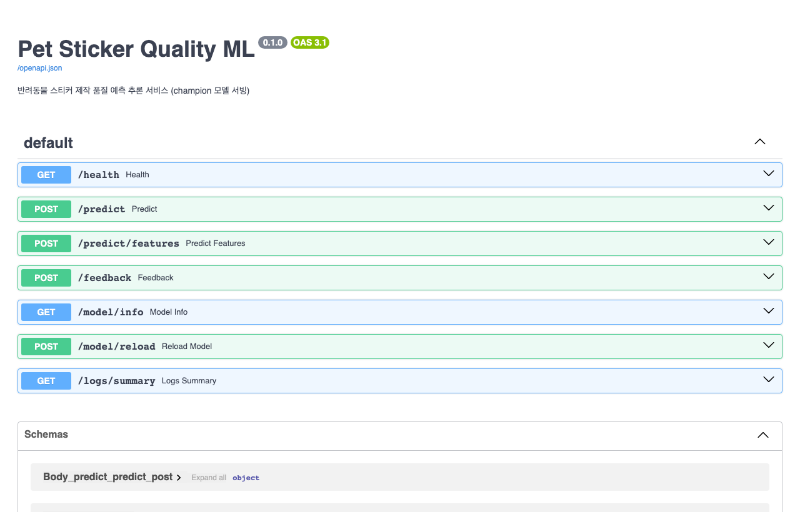

> **캡쳐 안내**: 앱 메인·관리자(로그인 포함)·ML 서비스(라이브 Render)·MLflow·CI 화면 캡쳐를 모두
> `docs/assets/` 에 포함했다(각 절 참조).

## 2. 소프트웨어 주요 기능

ML 기능과 일반 서비스 기능을 분리해 정리한다.

### 2-1. 사용자 핵심 기능(서비스)
1. 반려동물 사진 업로드(최대 5장) → 배경 제거(remove.bg) → 캔버스에서 A6(1240×1748) 시안 자동 생성
2. 시안 미리보기 및 고화질 PNG 다운로드
3. 주문 생성: 주문번호 발급 → 주문 파일 저장 → 카카오 오픈채팅 문의

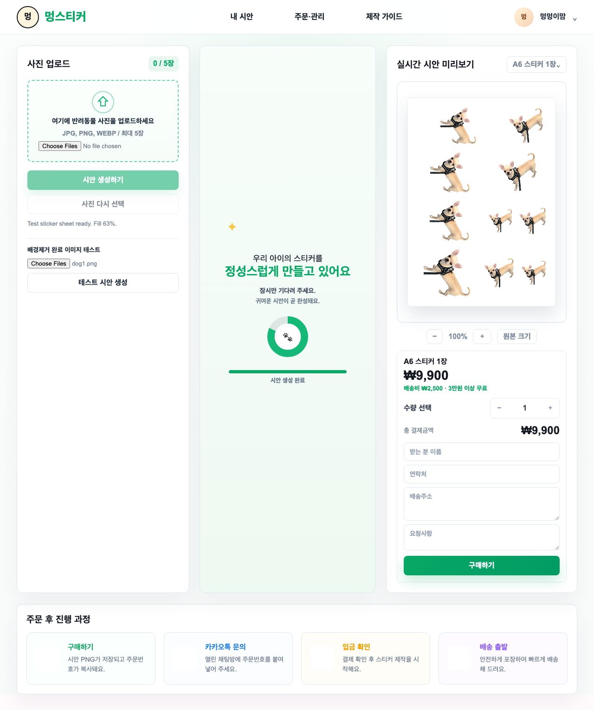

### 2-2. ML 모델이 사용되는 위치
- **구매(주문 저장) 시점**: Next.js `/api/orders` 가 업로드된 첫 사진을 ML 서비스 `POST /predict` 로 전달
- 응답(품질 점수·클래스·추천·모델버전)을 **주문 정보(order.json)에 `mlReport` 로 저장**하고
  메인 화면에 **품질 결과 카드**로 표시
- 관리자 화면(`/admin`)에서 주문별 ML 점수·모델버전, 예측/피드백 로그 요약, 챔피언 모델 정보 확인

### 2-3. 입력/출력
| 구분 | 입력 | 출력 |
|---|---|---|
| 서비스 | 반려동물 사진(최대 5장) | A6 스티커 시안 PNG |
| ML | 사진(이미지 바이트) → 특징 10종 추출 | `score(0~100)`, `qualityClass(3분류)`, `recommendation`, `confidence`, `modelVersion` |

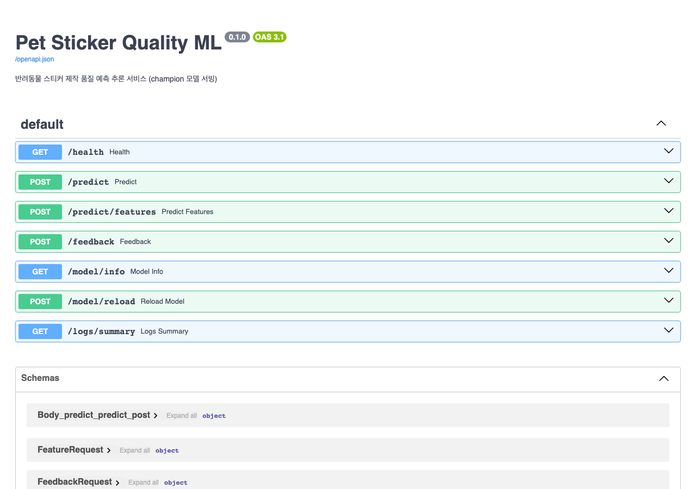

## 3. 실행 환경

- **OS**: macOS 26 (개발) / Ubuntu(GitHub Actions, Render 컨테이너)
- **Git/GitHub**: GitHub 저장소 + GitHub Actions CI/CD
- **Docker**: `pet-sticker-ml/Dockerfile`(python:3.12-slim), `pet-sticker-next/Dockerfile`(node:20-alpine, 멀티스테이지), 루트 `docker-compose.yml`
- **MLflow**: 2.22.x — 로컬 파일스토어(`mlruns/`, CI/하네스) + `mlflow server`(sqlite, 보고서 캡쳐용, http://localhost:5000)
- **언어/런타임**: Next.js 14.2 / React 18 / TypeScript 5, Python 3.12 / FastAPI / scikit-learn 1.9 / OpenCV(headless)
- **배포 환경**: Vercel(웹), Render(ML, Docker)

## 4. 전체 MLOps 파이프라인 구조

```
[코드 변경 흐름]  개발 → Git 커밋 → push → GitHub Actions(CI: next/ml/harness/docker) → Vercel/Render 배포
[모델 학습 흐름]  data(csv) → train.py(MLflow: param·metric·artifact·model + 레지스트리 등록)
[등록/반영 흐름]  model_promoter(macro-F1 개선 시 @champion 승격) → champion/ export(model.pkl+metadata.json)
                  → FastAPI 가 champion/ 로드 → /model/reload 로 무중단 반영
[서비스 운영 흐름] Next /api/orders → ML /predict → mlReport 저장 + 예측 로그 → /feedback → 피드백 로그
                  → /admin 모니터링 → (피드백 반영) 재학습(v2) → 승격 또는 롤백
```

관리자 대시보드(`/admin`)는 주문별 ML 점수·모델버전, 주문 통계, 챔피언 모델 정보(라이브 Render),
예측/피드백 로그 요약을 표시한다. **관리자 인증으로 보호**되며, 아래는 로그인 후 화면이다.

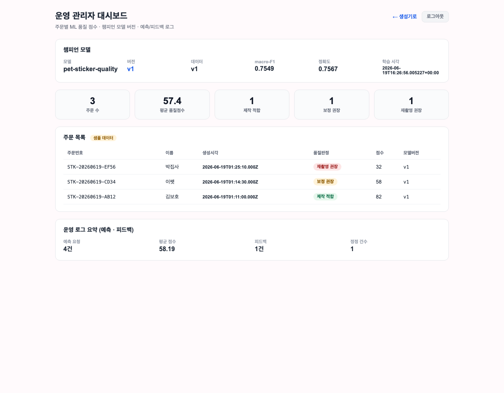

## 5. Git 기반 개발 과정

- **개발 흐름**: `main` 보호, `feature/mlops-fastapi-pipeline` 브랜치에서 기능 단위로 개발 후 PR.
- **커밋 전략**: Conventional Commits(`feat`/`ci`/`docs`) + **한글 본문**, 기능 단위로 8개 이상 분리.
  - `feat(ml): 스티커 품질 ML 패키지 골격과 특징 추출 추가`
  - `feat(ml): MLflow 학습 파이프라인과 챔피언 내보내기 구현`
  - `feat(ml): FastAPI 추론 서비스와 예측·피드백 로깅 추가`
  - `feat(next): 주문 API와 ML 품질 결과 연동`
  - `feat(next): 관리자 페이지로 주문·모델·로그 확인`
  - `feat(ops): Docker·compose·재학습/롤백 CLI·외부배포 설정 추가`
  - `ci: 통합 하네스·자동학습 워크플로 구성`
  - `docs: 최종 보고서 작성 및 실행 캡쳐 삽입`
- **브랜치 사용 여부**: 사용(상동). 기존 사용자 변경/원격 브랜치는 보존.

## 6. CI/CD 구성

`.github/workflows/ci.yml` — push/PR 트리거, 4개 잡:
- **next**: `npm ci` → `typecheck` → `build`
- **ml**: setup-python 3.12 → `ruff` → `pytest` → `MLflow 학습` → **학습 artifact 업로드**(champion/, mlruns/)
- **harness**: Node+Python 설치 후 `HARNESS_STRICT=1 node scripts/final-harness.mjs`(앱↔ML 교차검증)
- **docker**(push 한정): ML/Next 이미지 빌드

`.github/workflows/auto-train.yml` — **자동 재학습**: `pet-sticker-ml/data/**`·`train.py`·`dataset.py` 변경 또는
`workflow_dispatch` 시 `pytest → train → model_promoter(승격 평가) → artifact 업로드`.

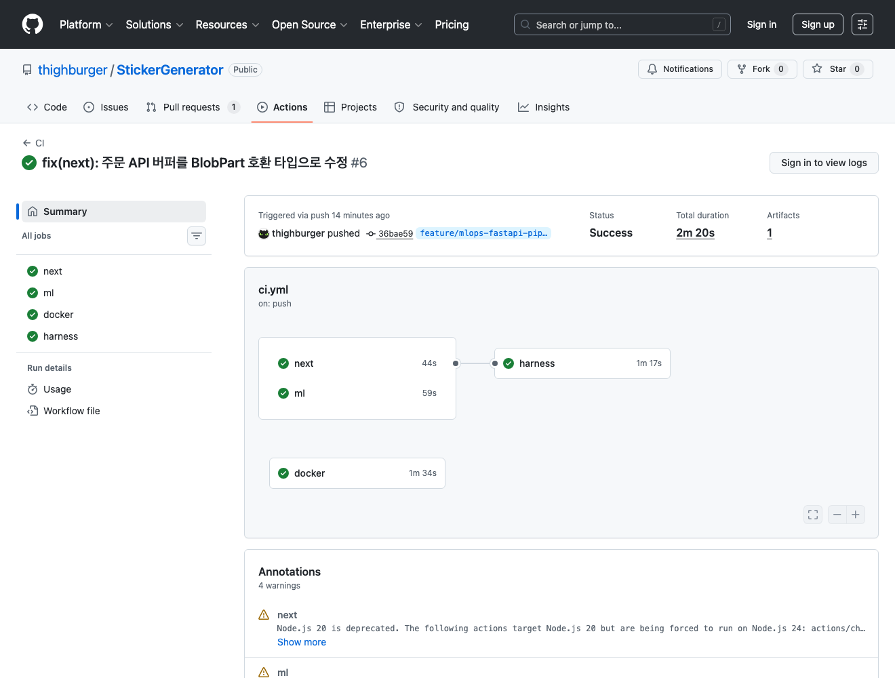

## 7. Docker 기반 환경 구성

- **ML(`pet-sticker-ml/Dockerfile`)**: `python:3.12-slim` + `libgomp1`, 의존성 설치, `src/champion/data` 복사,
  비루트 실행, `HEALTHCHECK /health`, `uvicorn ... --factory`(포트 8000).
- **Next(`pet-sticker-next/Dockerfile`)**: deps→builder→runner 멀티스테이지(node:20-alpine), `sample-orders` 포함.
- **`docker-compose.yml`**: `ml`(8000, healthcheck, logs 볼륨) + `next`(3000, `depends_on: ml healthy`,
  `ML_SERVICE_URL=http://ml:8000`) + `mlflow`(profile `tracking`, 5000).
- **실행**: `docker compose up -d --build` → `curl localhost:8000/health` → `localhost:3000`.

> Docker 실행 상태(`docker compose ps`)는 로컬에서 확인하며, CI 의 `docker` 잡에서 ML/Next 두
> 이미지 빌드가 통과했다(6절 GitHub Actions 캡쳐 참조).

## 8. ML 모델 구성

- **사용 데이터**: 라벨링된 공개 데이터가 없어, 특징값을 현실적 분포에서 샘플링하고 **문서화된 품질 점수
  휴리스틱 + 라벨 노이즈**로 3분류 라벨을 만든 합성 데이터(시드 고정, 완전 재현). 추론 시에는 실제 업로드
  이미지에서 **동일한 특징 10종**(해상도·메가픽셀·종횡비·밝기·대비·선명도(Laplacian 분산)·색감·피사체 비율·
  엣지밀도)을 PIL/OpenCV 로 추출 → 진짜 이미지 ↔ ML 연결.
- **모델 종류**: `Pipeline(StandardScaler → RandomForestClassifier(class_weight=balanced))`, 3분류.
  품질 점수(0~100)는 클래스 확률 가중합(`100·P(적합)+50·P(보정)`)으로 산출.
- **학습 코드**: `train.py` — train/test 분할 → 학습 → 평가 → MLflow 기록 → 레지스트리 등록 → 챔피언 export.
- **평가 지표**: accuracy, **macro-F1(승격 기준)**, 클래스별 F1, score_mae.
- **초기(v1) vs 신규(v2) 비교**:

| 모델 | 데이터 | 표본 | macro-F1 | accuracy | score_mae |
|---|---|---|---|---|---|
| v1 (초기) | sticker_quality_v1 | 1500 | **0.7549** | 0.7567 | 15.13 |
| v2 (재학습) | sticker_quality_v2 | 2200 | **0.7783** | 0.78+ | ↓ |

## 9. MLflow 기반 실험 관리

- **Tracking 사용**: 로컬 파일스토어(`file:./mlruns`)를 기본으로, 보고서 캡쳐는 `mlflow server`(sqlite, :5000).
- **기록 항목**:
  - **parameter**: data_version, seed, n_estimators, test_size, model_type, feature_count, n_samples 등
  - **metric**: accuracy, macro_f1, score_mae, 클래스별 f1
  - **artifact**: `features.json`, `confusion_matrix.png`, `classification_report.txt`, `dataset_version.txt`, 입력 CSV
  - **model**: `mlflow.sklearn.log_model` + 레지스트리 `pet-sticker-quality` 등록
- **최고 모델 선정 기준**: **macro-F1** 이 현재 챔피언 + `min-delta` 이상 개선되면 `@champion` 승격.

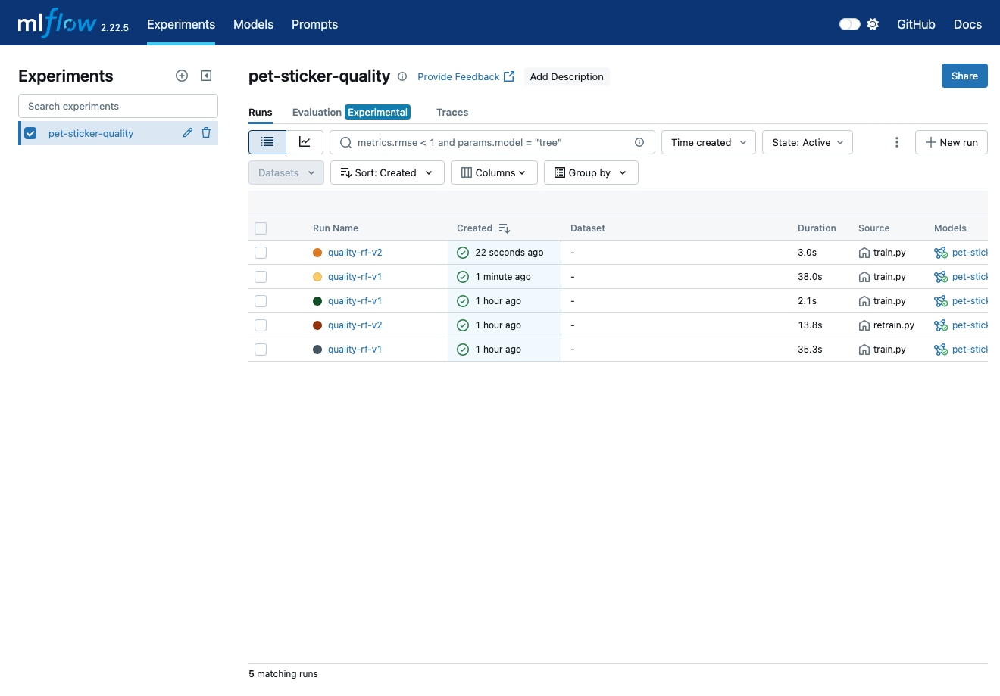

## 10. 모델 등록 및 서비스 반영

- **저장 방식**: MLflow 레지스트리(`pet-sticker-quality`, `@champion` alias) + **포터블 export**
  `champion/model.pkl` + `champion/metadata.json`(버전·metric·featureNames·classes).
- **서비스 로드**: FastAPI 가 시작 시 `champion/` 만 로드(서버 불필요 → CI/Docker 재현성). `GET /model/info` 로 버전 확인.
- **신규 반영**: 승격 후 `POST /model/reload` 로 무중단 재로딩(또는 컨테이너 재시작).
- **자동/수동 선택**: **반자동** — 학습은 자동(CI), 승격은 `model_promoter` 가 metric 비교로 자동 결정하되,
  운영 반영은 명시적 reload/배포로 통제(안전성 우선). 근거: 잘못된 모델의 즉시 무중단 반영 리스크 차단.

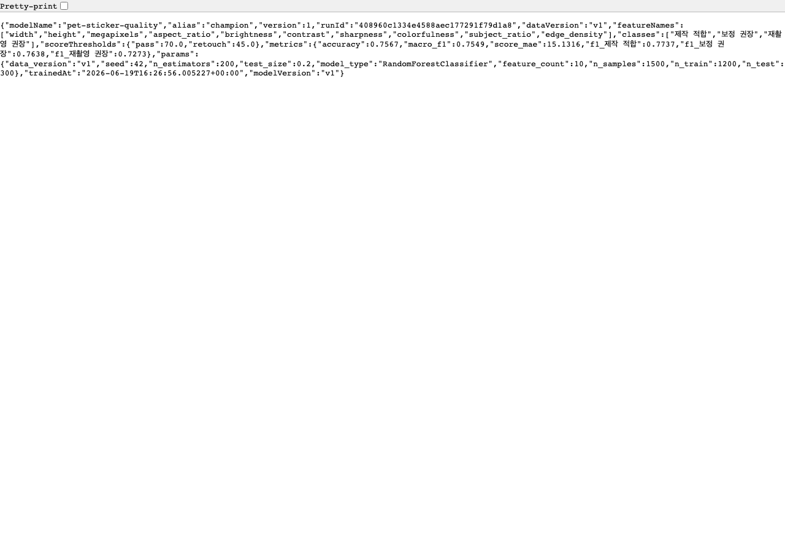

## 11. 재학습 또는 모델 개선 과정

- **이유/방법**: 사용자 피드백(흐릿/경계 사례 오판)을 반영해 **라벨 노이즈를 줄이고 표본을 늘린** 데이터 v2 로
  `python -m pet_sticker_ml.retrain --data-version v2` 재학습.
- **무엇이 바뀌었나**: 데이터(v1→v2). 코드/파라미터는 동일.
- **전/후 성능**: macro-F1 0.7549 → **0.7783** 로 향상 → `model_promoter` 가 v2 를 챔피언(v2)으로 승격.
- **모델 교체 결과**: 이전 챔피언(v1)은 `model_history/v1/` 에 보관, 서비스는 v2 로 전환.

## 12. 운영 로그 및 문제 대응

- **서비스 로그**: 컨테이너 stdout + Next API 응답.
- **예측 요청 로그**: `logs/prediction_log.csv`(시간·요청ID·소스·모델버전·점수·클래스·신뢰도+특징값).
- **피드백 로그**: `logs/feedback_log.csv`(예측/교정 클래스 → 재학습 데이터).
- **모델 정보 확인**: `GET /model/info`, 관리자 화면.
- **일부러 발생시킨 문제 1**: 로컬 Python 3.14 환경에서 `mlflow`/`scikit-learn` 휠 부재로 설치 실패.
  - 원인: 3.14 가 너무 최신이라 바이너리 휠 미배포.
  - 해결: ML 환경을 **3.12 로 고정**(`uv` 로 standalone CPython 설치, `.python-version`, CI `setup-python 3.12`),
    하네스는 3.11/3.12 자동 탐색 + 미존재 시 명확한 SKIP 안내.
- **문제 2**: `mlflow.sklearn.log_model(name=...)` 인자 오류(2.x 는 `artifact_path`). → 시그니처 수정으로 모델/레지스트리 정상 기록.

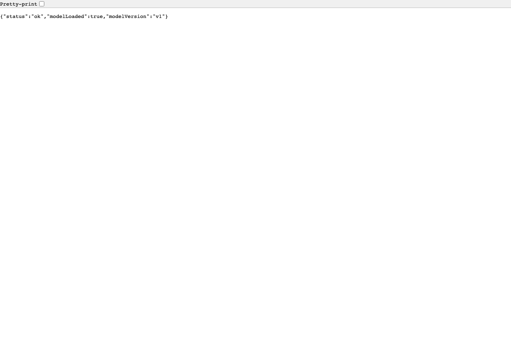

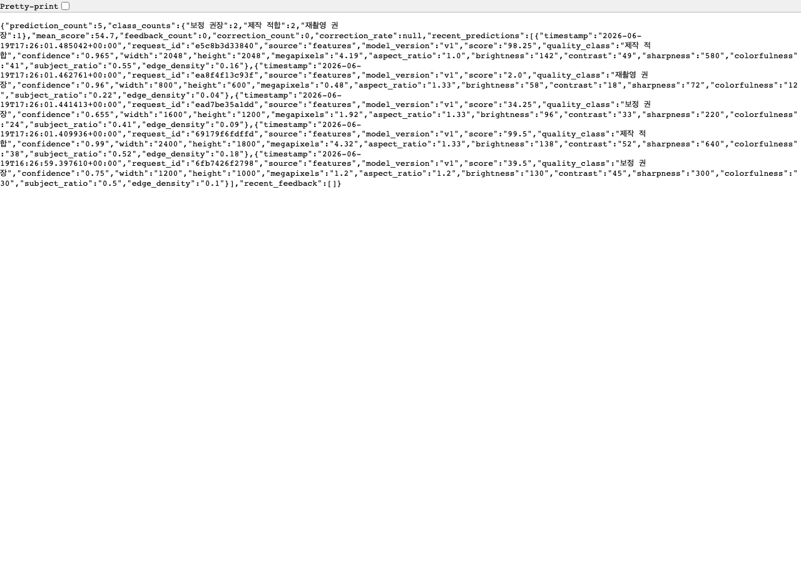

## 13. 롤백 및 이전 모델 관리

- **이전 모델 보관**: 승격 시 직전 챔피언을 `model_history/v{n}/` 에 자동 보관.
- **롤백 방법**: `python -m pet_sticker_ml.rollback --list` 로 버전 확인 →
  `python -m pet_sticker_ml.rollback --to 1` 로 v1 복원(현재 챔피언도 보관 후 교체, 레지스트리 alias 동기화).
- **버전 관리**: `champion/metadata.json` 의 `version`/`alias`/`metrics`/`runId` + MLflow 레지스트리 `@champion`.
- 실제 동작: v2 승격 → 롤백 `--to 1` → 챔피언이 v1(macro_f1 0.7549, `rolledBack=true`)로 복귀 확인.

## 14. 전체 파이프라인 동작 흐름

1. **코드 수정 → 서비스 반영**: 커밋/푸시 → CI(next/ml/harness) 통과 → Vercel/Render 배포.
2. **데이터 변경 → 재학습**: `data/**` 변경 푸시 → `auto-train.yml` 자동 실행(test→train→promote→artifact).
3. **모델 변경 → 운영 반영**: 승격으로 `champion/` 갱신 → `/model/reload` → `/model/info` 버전 변경 확인.

## 15. 문제 해결 경험

- 12절의 두 문제(3.14 휠, log_model 시그니처) 외에:
- **하네스 플레이키 방지**: 포트 바인딩 의존을 없애기 위해 예측/로그 검증은 순수 함수 호출, 모델정보 API 는
  FastAPI **TestClient(인프로세스)** 로 검증. 실제 포트 헬스체크는 `--full` 모드의 docker compose 단계로 분리.
- **`.gitignore` 충돌**: `orders/` 규칙이 `app/api/orders/` 라우트까지 무시 → `/orders/` 로 한정해 해결.

## 16. 느낀 점 및 개선 방향

- **배운 점**: 모델 정확도보다 **학습→등록→서빙→교체→롤백→모니터링→재학습**의 연결과 재현성이
  MLOps 의 핵심임을 체감. champion 포터블 export 로 서빙을 MLflow 서버와 분리하니 CI/Docker 재현이 쉬워졌다.
- **개선하고 싶은 점**: 실제 라벨 데이터 수집·라벨링 파이프라인, 데이터/모델 드리프트 모니터링, 자동 승격→배포까지 무중단 연결.

## 17. 참고 자료

- 강의 자료: MLOps 개요, MLflow 로컬/서버 실습, GitHub Actions 기반 자동 훈련, 모델 교체/운영 전략, 사용자 피드백·모니터링, 로깅, DevOps 정리
- MLflow / scikit-learn / FastAPI / Next.js 공식 문서
- 중간 프로젝트 보고서(스티커 생성 서비스 MVP)

---

## 18. 실서비스 강화 기능 (추가 구현)

초기 파이프라인 완성 후, **실제 서비스로서 부족한 점**을 점검해 기능을 추가했다. 각 기능은 별도 PR 로
구현·리뷰·머지했다(기능 단위 커밋·CI 통과·스크린샷 포함).

### 18-1. 관리자 인증 (보안)

**문제(부족한 점)**: 운영 관리자 페이지 `/admin` 이 인증 없이 공개되어, 누구나 전체 고객의 이름·연락처·
주소가 담긴 주문 정보를 열람할 수 있었다(개인정보 노출 위험).

**구현**:
- Next.js **미들웨어**(`middleware.ts`)로 `/admin/:path*` 전 경로를 보호. 유효 세션 쿠키가 없으면
  `/admin/login` 으로 리다이렉트(`GET /admin` → `307`).
- 로그인 페이지(`/admin/login`)에서 비밀번호 확인 → `ADMIN_SECRET` 기반 **HMAC-SHA256 세션 토큰**을
  httpOnly 쿠키로 발급(`lib/auth.ts`, Web Crypto 로 Edge/Node 공용). 비밀번호는 쿠키/클라이언트에 노출되지 않음.
- 대시보드에 **로그아웃** 버튼 추가. 비밀번호·시크릿은 환경변수(`ADMIN_PASSWORD`, `ADMIN_SECRET`)로 주입.

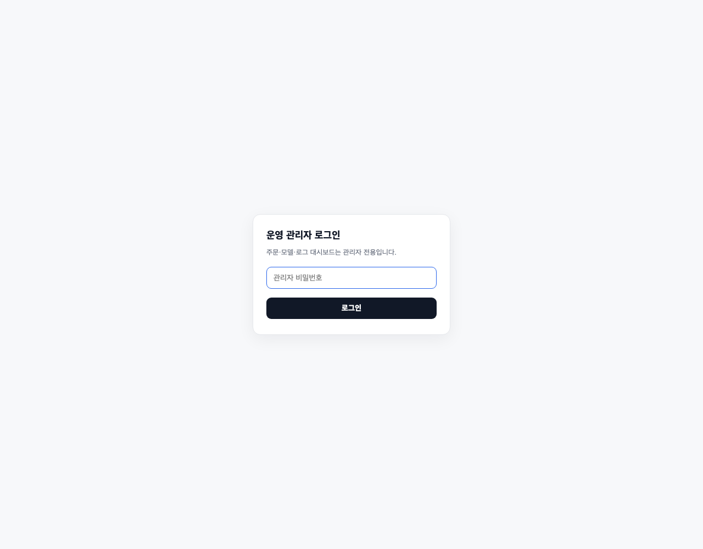

로그인 성공 후에는 위 4절의 관리자 대시보드(라이브 챔피언 모델·주문 통계·로그 요약)로 진입한다.

### 18-2. 인앱 ML 피드백 (human-in-the-loop)

**문제(부족한 점)**: ML 품질 판정에 대한 사용자 의견을 수집할 화면이 없어, `/api/feedback`(및 ML
`/feedback`)가 있어도 피드백이 실제로 쌓이지 않았다(재학습 데이터 공백).

**구현**:
- 구매 후 표시되는 **품질 결과 카드**에 피드백 위젯(`MlFeedback`) 추가: "👍 정확해요" 또는
  "✏️ 다른 판정"(올바른 클래스 선택) → `/api/feedback` → ML `/feedback` → **피드백 로그** 적재.
- 예측 `requestId`·예측 클래스·교정 클래스·주문번호를 함께 기록해 **재학습 데이터**로 활용.
- 실패 시에도 사용자 흐름을 막지 않으며(graceful), 제출 후 감사 메시지를 표시한다.

아래는 실제 구매 흐름에서 **라이브 Render 모델(v1)** 이 "재촬영 권장(24점)"으로 판정하고, 사용자가
그 판정을 확인/교정할 수 있는 화면이다.

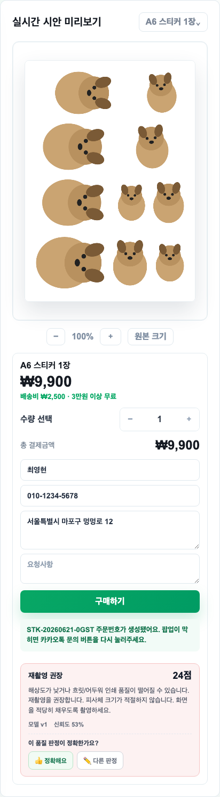

---

### 부록 A. 평가 기준 ↔ 구현 대응표

| 평가 기준(배점) | 대응 구현 |
|---|---|
| MLOps 파이프라인 완성도(35) | Git→CI(`ci.yml`)→Docker(`compose`)→MLflow(`train.py`)→배포(`render.yaml`/Vercel) 전체 연결, 하네스로 교차검증 |
| Git 이력/개발 과정(10) | feature 브랜치 + 한글 기능단위 커밋 8+개 + PR |
| 자동화(10) | push 시 typecheck/build/test 자동, `auto-train.yml` 자동 재학습·승격 |
| MLflow 활용/모델 관리(15) | experiment/run, param·metric·artifact·model 기록, 레지스트리+@champion, v1/v2 비교 |
| 앱·ML 기능(10) | `/api/orders`→ML `/predict`, 결과 카드·주문 저장·관리자 화면 연동 |
| Docker/실행환경(5) | ML/Next Dockerfile + compose + healthcheck |
| 배포/운영(5) | Vercel/Render 배포, `/health`·예측/피드백 로그·관리자 모니터링 |
| 보너스(10) | 롤백 CLI, 자동 승격, 강화된 테스트(23개)+통합 하네스, 운영 로그 분석, 재학습 파이프라인, **관리자 인증(보안)** 등 실서비스 강화(18절) |

---

### 부록 B. 캡쳐 목록 및 작성 환경 안내

`docs/assets/` 에 포함된 실제 캡쳐:

| 파일 | 내용 |
|---|---|
| `mlflow-ui.png` | MLflow 실험 run 목록(5 run, train.py/retrain.py 출처, 등록 모델) |
| `model-info.png` | 챔피언 모델 정보 API(버전·alias·metric·featureNames) |
| `logs-summary.png` | 예측/피드백 로그 요약(운영 로그) |
| `fastapi-docs.png` | FastAPI 추론 서비스 Swagger 문서 |
| `health.png` | 서비스 상태(`/health`, 로컬) |
| `github-actions.png` | CI 전체 잡 통과(next·ml·docker·harness) + workflow 그래프 |
| `deploy-render-health.png` | **라이브 Render 배포** `/health` 외부 응답 |
| `deploy-render-docs.png` | **라이브 Render 배포** FastAPI Swagger(`/docs`) |
| `app-main.png` | 웹 앱 메인(업로드·시안 생성·구매) |
| `admin-login.png` | 관리자 로그인 화면(보안) |
| `admin-dashboard.png` | 관리자 대시보드(로그인 후, 라이브 챔피언·주문·로그) |
| `ml-feedback.png` | 인앱 ML 피드백 위젯(품질 결과 카드, 라이브 모델 판정) |

**실제 외부 배포 완료**: ML 서비스는 Render 에 라이브 배포되어 https://pet-sticker-ml.onrender.com 으로
외부에서 접속·동작이 확인된다. 웹 앱(Next.js)도 Vercel `main` 에 자동 배포되어 빌드 성공 상태다.

캡쳐는 모두 자동화 스크립트로 생성한다(로컬에서 앱을 띄우고 Playwright 로 촬영):

```bash
npm run dev   # 또는 docker compose up -d --build
npm run capture
```

> 참고: Vercel 배포에는 배포 보호(인증)가 켜져 있어 *배포된* URL 의 외부 자동 캡쳐는 401 로 차단되므로,
> 앱/관리자 화면은 로컬 실행본을 라이브 Render ML 에 연결해 촬영했다(데이터·동작은 동일).
